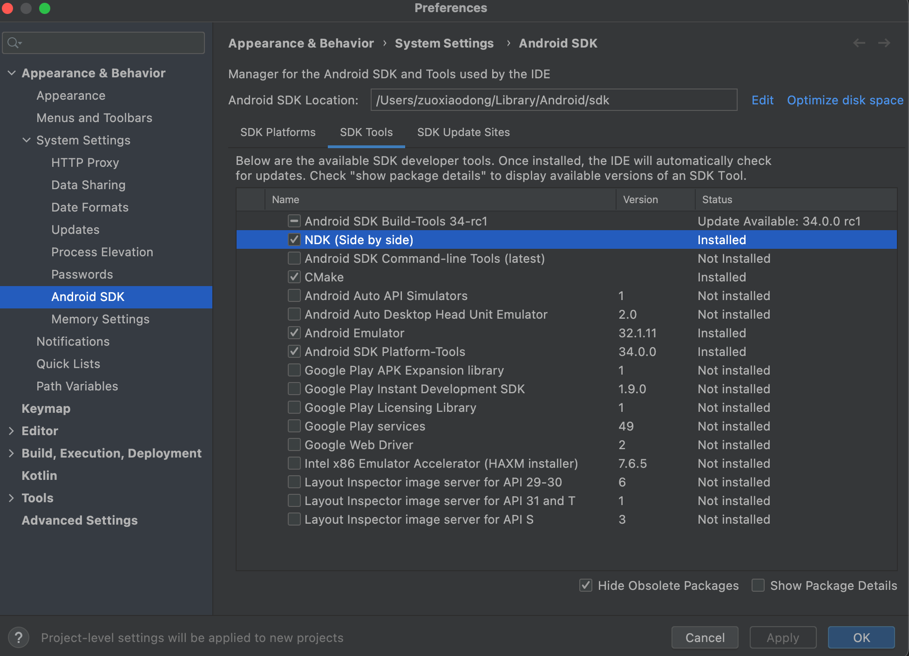
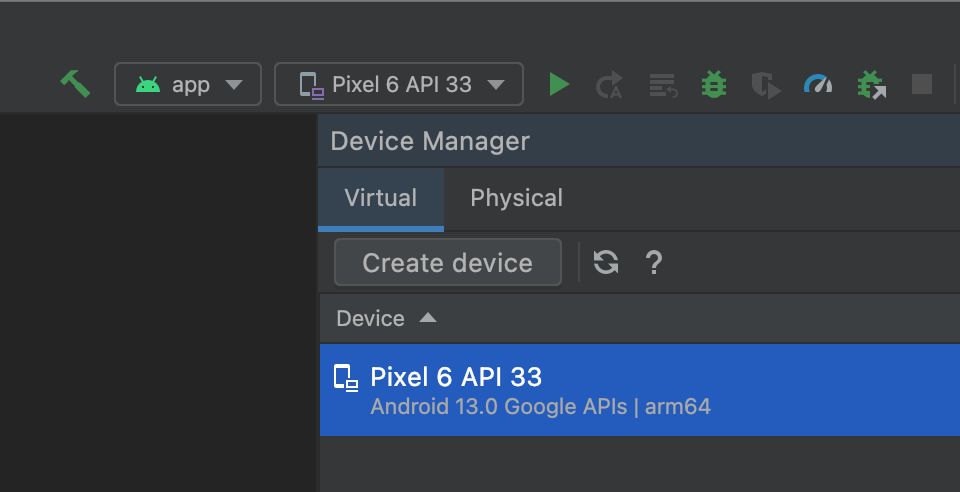
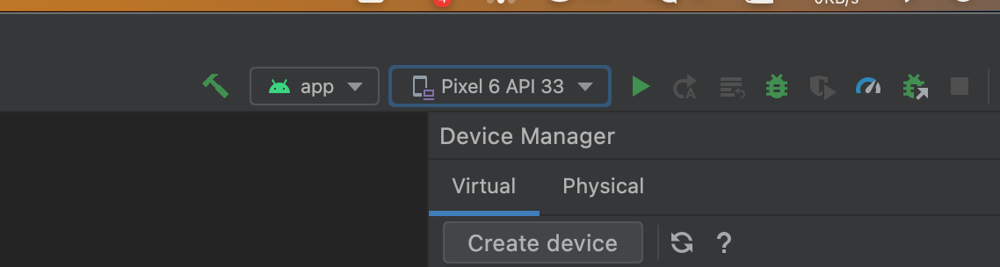
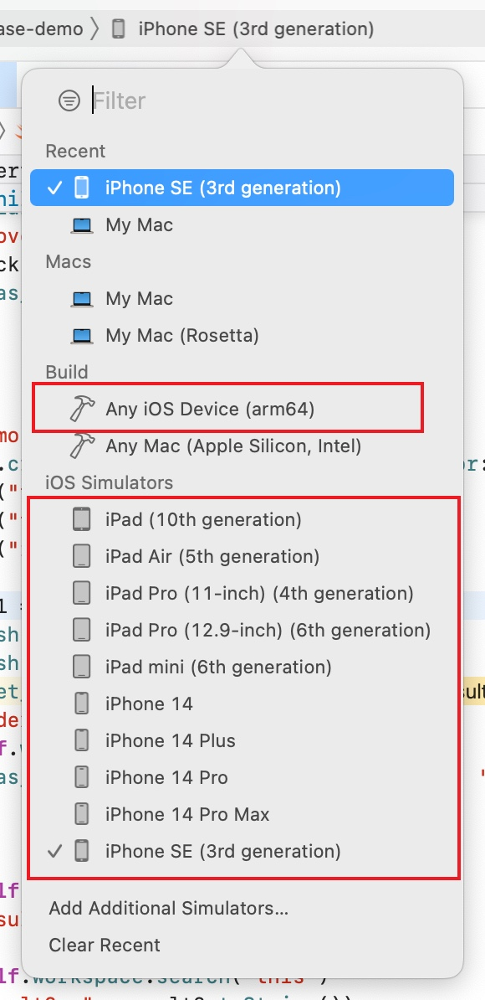

# Binding Develop Guide

## Android Binding

### Prepare Development Environment

-   First, install and configure Android Studio. Visit the official website at https://developer.android.com/studio to download and install it.

-   Next, install NDK to compile Rust code on an Android device. After starting the project, select Tools > SDK Manager from the top toolbar in Android Studio. On the SDK Platforms tab, find the Android version that is suitable for your device (Android 12.0 is recommended) and install the corresponding NDK.

    

-   Create an ADV virtual machine: You can create an ADV virtual machine using the AVD Manager.

    

### Run OctoBase demo app

To run the OctoBase project, execute the following commands in the OctoBase\apps\android directory:

```sh
cargo install cargo-ndk
rustup target install armv7-linux-androideabi
rustup target install aarch64-linux-android
```

Use Android Studio to select and launch project in `apps/android`.

Then, select the app and launch OctoBase Demo App.



### Export Interfaces

To export interfaces, modify two files:

-   The files in the libs/jwst-binding/jwst-jni/src directory.
-   The JWST.kt file in the libs/jwst-binding/jwst-jni/android/src/main/java/com/toeverything/jwst directory.

## Swift Binding

### Prepare Development Environment

-   Download and install Xcode from the App Store.
-   Open the project and select the IDE environment's virtual machine.
-   Configure Command Line Tools. If Git is replaced, execute the following commands:

    ```sh
    xcode-select --install
    sudo xcode-select --switch /Library/Developer/CommandLineTools
    ```

### Run OctoBase demo app

-   Execute the following command in the OctoBase root directory:

    ```sh
    cargo run -p jwst-swift-integrate
    ```

-   Make sure the compilation target is iOS/iPadOS

    

-   Launch the project in the IDE at apps/swift.

### Export Interfaces

-   Export the OctoBase interfaces in the libs/jwst-binding/jwst-swift/src directory.
-   Write the sample code in apps/swift/OctoBase-demo.

Please note that developers need to carefully study and understand the files to make sure that all details are correctly managed during the development process.
