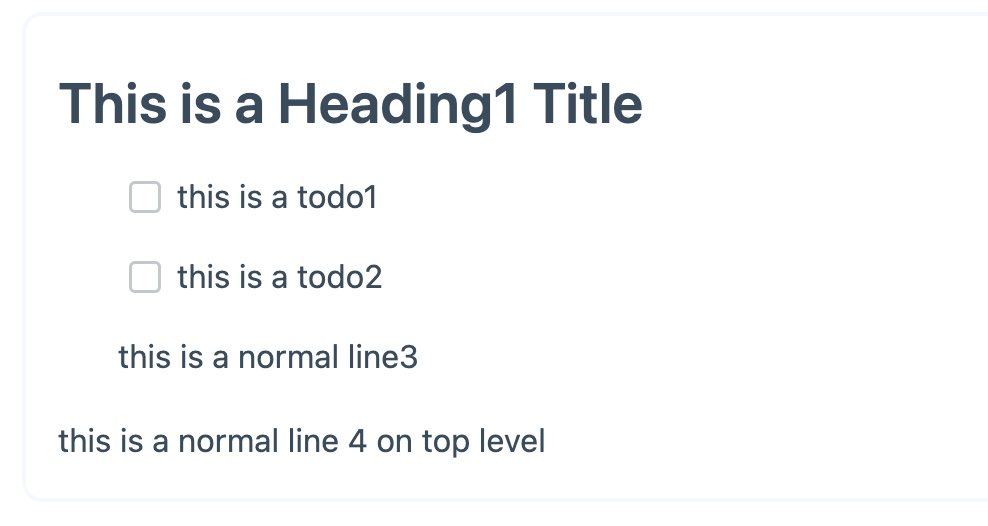

# How to organize you own data with JWST

## An Example how to use the JWST Data Model

In JWST, Block will storage in a flat Map like structure, and every block will has some common key-value like this:

```js
Map {
    "page_id": Block {
        // difference flavor means different block type
        "sys:flavor": "affine:page",
        // block create timestamp
        "sys:created": 1666158236651,
        // block's children, all children will be a block_id that can link to another block
        // page block has top level blocks children
        "sys:children": ["block_id1", "block_id5"],
    },
    "block_id1": Block {
        "sys:flavor": "affine:heading1",
        "sys:created": 1666158236651,
        "sys:children": ["block_id2", "block_id3", "block_id4"],
        // all you custom data will storage with a prop prefix
        "prop:title": "This is a Heading1 Title"
    },
    "block_id2": Block {
        "sys:flavor": "affine:todo",
        "sys:created": 1666158236651,
        "sys:children": [],
        // all you custom data will storage with a prop prefix
        "prop:text": "this is a todo1",
        "prop:clicked": false
    },
    "block_id3": Block {
        "sys:flavor": "affine:todo",
        "sys:created": 1666158236651,
        "sys:children": [],
        // all you custom data will storage with a prop prefix
        "prop:text": "this is a todo2",
        "prop:clicked": false
    },
    "block_id4": Block {
        "sys:flavor": "affine:text",
        "sys:created": 1666158236651,
        "sys:children": [],
        // all you custom data will storage with a prop prefix
        "prop:text": "this is a normal line3",
    },
    "block_id5": Block {
        "sys:flavor": "affine:todo",
        "sys:created": 1666158236651,
        "sys:children": [],
        // all you custom data will storage with a prop prefix
        "prop:text": "this is a normal line 4 on top level",
    }
}
```

You can image that structure like a tree, we can organize them on view like this:



On above image, every lines are a block, so we can easily reorder them based on `sys:children` edit, JWST provide a series of API to help you do that.

And you also can see that lines has difference style, like todo checkbox or heading1, that types will change by `sys:flavor` key, and you can add your own flavor to extend JWST.

How the flavor of a block should be expressed depends on the definition of the developer. For example, in the rich text block editor, we usually define different flavors as different text line types, such as todo, h1/h2/h3, unordered list, etc. , and in the whiteboard, we can define a block as different graphics, such as squares, triangles, pentagrams, etc., and we can define the length, width, height, brush trajectory, etc. of different graphics through `prop:xxx`.

JWST provides a series of API interfaces so that you can easily organize the relationship between various blocks - parent-child relationship of blocks, front and back order, etc., as well as modifications to basic data structures such as rich RichText, Map, Array, etc., and all these modifications can be Conflict-free merge with any remote offline.
