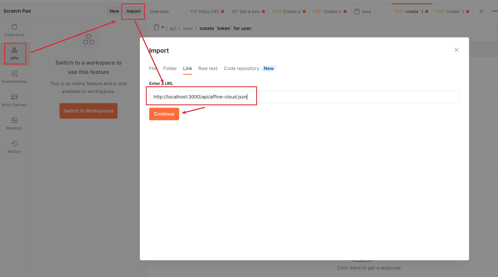

# Quick Start

In this quick start, you install the JWST docker and JWST container that gets you JWST server access to your JWST integration.

## What you learn

-   How to call JWST APIs without writing a line of code
-   How to send your first SDK request

## Initial setup

### Setup the Docker

Go to [Docker Official Docs](https://docs.docker.com/engine/install/) and choose your system, then installl Docker.

### Setup the JWST server

1. To install the JWST server, run:

```sh
docker pull ghcr.io/toeverything/jwst:nightly-latest
```

2. Now that you’ve installed the JWST, you can start server:

```sh
docker run -it --rm -p 3000:3000 ghcr.io/toeverything/jwst:nightly-latest
```

If everything worked, the command-line displays the following response.

```nginx
[09-15 15:03:38][ INFO][keck::server] listening on 0.0.0.0:3000
```

Then you can access the frontend from [localhost:3000](http://localhost:3000)

### Start template frontend project

1. Clone the official repos

```sh
git clone https://github.com/toeverything/jwst.git
```

2. Install dependencies

```sh
cd jwst
cd frontend
npm i -g pnpm
pnpm i
```

3. Start the frontend project

```sh
pnpm start
```



Now you can access http://localhost:4200 to view the frontend page. There has a block id and two synced readonly text input, you can copy the block id, then replace `{block_id}` and use the follow command to send request to the jwst server, then that frontend text input will change automatically.

```sh
curl -X 'POST' \
  'http://localhost:3000/api/block/test/{block_id}' \
  -H 'accept: */*' \
  -H 'Content-Type: application/json' \
  -d '{"data":"textbox"}'
```
