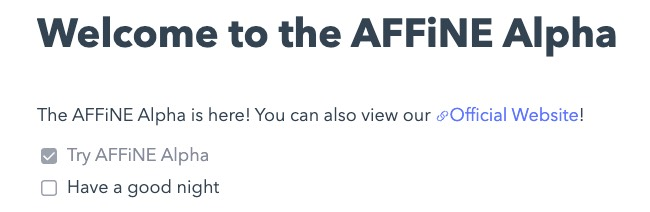

# How to organize data with OctoBase

In OctoBase, we unify different data structures into the concept of Block, and different Blocks have similar properties.

For example, headings, normal text lines, and Todo all have a text content property in common, but their flavour is different, while Todo has a clicked property that confirms completion.

In this way, we can define different Block flavours to represent different data types, for example:

```js
const titleBlock = {
	'sys:id': '3380496952:1',
	'sys:flavour': 'affine:title',
	'sys:created': 1666158236651,
	'sys:children': [],
	'prop:text': 'This is a Title',
}
const textBlock = {
	'sys:id': '3380496952:2',
	'sys:flavour': 'affine:text',
	'sys:created': 1666158236651,
	'sys:children': [],
	'prop:text': 'This is a normal line',
}
const todoBlock = {
	'sys:id': '3380496952:3',
	'sys:flavour': 'affine:todo',
	'sys:created': 1666158236651,
	'sys:children': [],
	'prop:text': 'This is a todo',
	'prop:clicked': false,
}
```

To illustrate with a simple example, suppose we have a page with a title, a todo list, and a normal text line, as shown in the following image:



In OctoBase, we can define it like this:

1. We treat a page as a Block
2. We also treat the title and text line as a Block
3. Each line of content in a Page is treated as a child in the Page Block

Then we can reorganize the data shown in the figure above with Block:

```js
const title = {
	'sys:id': '3380496952:1',
	'sys:flavour': 'affine:title',
	'sys:created': 1666158236651,
	'sys:children': [],
	'prop:text': 'Welcome to the AFFiNE Alpha',
}
const text = {
	'sys:id': '3380496952:2',
	'sys:flavour': 'affine:text',
	'sys:created': 1666158236651,
	'sys:children': [],
	// Here we ignore how to express rich text Link
	'prop:text': 'The AFFiNE Alpha is here! You can also view our Official Website!',
}
const todo1 = {
	'sys:id': '3380496952:3',
	'sys:flavour': 'affine:todo',
	'sys:created': 1666158236651,
	'sys:children': [],
	'prop:text': 'Try AFFiNE Alpha',
	'prop:clicked': true,
}
const todo2 = {
	'sys:id': '3380496952:4',
	'sys:flavour': 'affine:todo',
	'sys:created': 1666158236651,
	'sys:children': [],
	'prop:text': 'Have a good night',
	'prop:clicked': false,
}

title.children = [text, todo1, todo2]
```

At this point we have reorganized a rich text page into structured data, and now we can:

-   Change the order of text lines by adjusting the order of children
-   Change the text line style by adjusting the flavour
-   Change the actual text content by adjusting the content in the props

In actual use, you do not need to manually edit the data in the structure. OctoBase provides a series of easy-to-use APIs that allow you:

-   Organize parent-child relationship of blocks, front and back order, etc.
-   Modify the properties with basic data structures such as RichText, Map, Array, String, Number, etc.
-   Reactively update data when local or remote modifications occur

And all these modifications can be Conflict-free merge with any remote offline.

## Data Structure Under the Hood

`Workspace` is the top level of collaboration entity, it holds a map-like structure which stores `Space`, `Space` holds a map-like structure which stores `Block`.

`Workspace`, `Space`, `Block` forms a tree structure, and `Block` is the smallest unit of data in OctoBase.

```
           Workspace
         /           \
     Space    ...   Space
    /  |  \        /  |  \
Block ... Block Block ... Block
```

## Collaborative Workspace

Each `Workspace`, `Space`, `Block` can be regarded as a single unit capable of conflict solving, and thus can be seen as a collaborative unit.

With easy-to-use APIs provided by OctoBase, `Workspace` can be easily transferred through kind of providers, as network, local storage, etc. In this way Different clients can manipulate and collaborate the same `Workspace`, also `Space`, `Block` belongs to it.

Octobase ensures workspaces in different clients with the same `workspace_id` are always the same one. However, please note that `Space` created within the same `Workspace` in different devices with the same `space_id` is not guaranteed to be the same `Space`. Specifically speaking, If the `Space` is created in one device, and synced to other devices, they will be the same `Space`, but if it's created separately in different devices, it's not the same one! This will make any further manipulation under the `Space` lose the ability of auto-conflict solving, which will downgrade to overriding strategy.

To avoid this collision, we recommend a best practice that when creating a `Space`, use a random `space_id`. This can ensure that the `Space` with specific `space_id` is created only once (In the absence of random number collision), and is synced before it's manipulated by other devices. In this way, `Space` will never lose its auto-conflict solving capability. Feel free to manipulate the same collaborative unit on different devices and enjoy the auto-conflict solving!
