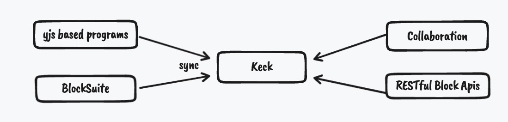
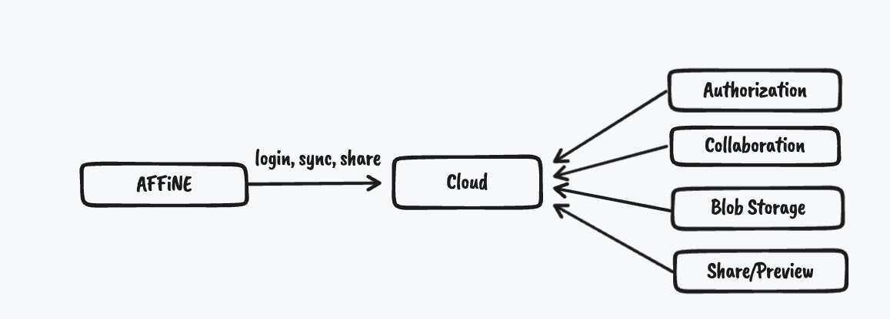

# Project Overview

OctoBase's repo is a monorepo, including `cargo workspace` and `pnpm workspace`.

You can see the source code directory of all executable programs in the `apps` folder:

## Server program

`cloud` and `keck` are our server programs, they are all built based on OctoBase.

### Keck

The original meaning of `Keck` is [WM Keck Observatory], and it was the largest astronomical telescope in the world when it was built.

`Keck` is the first synchronous server prototype developed by affine. Its first version was written in `node.js` and then ported to rust. Currently its synchronization logic is abstracted and moved to `jwst-rpc`, which currently provides high-performance data synchronization service and is compatible with yjs, and a RESTful API that can read and modifies BlockSchema create by AFFiNE/BlockSuite/OctoBase client.

### Cloud

`Cloud` is a fully functional server of affine-cloud, which provides features including login, user management, collaboration and blob storage.

`Cloud` server can be used as the backend of AFFiNE and supports a variety of storage backends.

## Binding

The `android` and `swift` folders are the bindings of OctoBase to `Android` and `Swift` respectively.

The folders contain corresponding example projects. Users can use `kotlin` or `swift` to call OctoBase to read and write data that compatible with AFFiNE/BlockSuite/OctoBase clients.

## Homepage

`homepage` is OctoBase's home page and documentation, Welcome to GitHub to submit pr to this [document].

[WM Keck Observatory]: https://en.wikipedia.org/wiki/W._M._Keck_Observatory
[document]: https://github.com/toeverything/OctoBase/tree/master/apps/homepage/pages/docs
